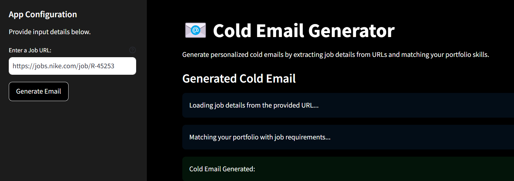
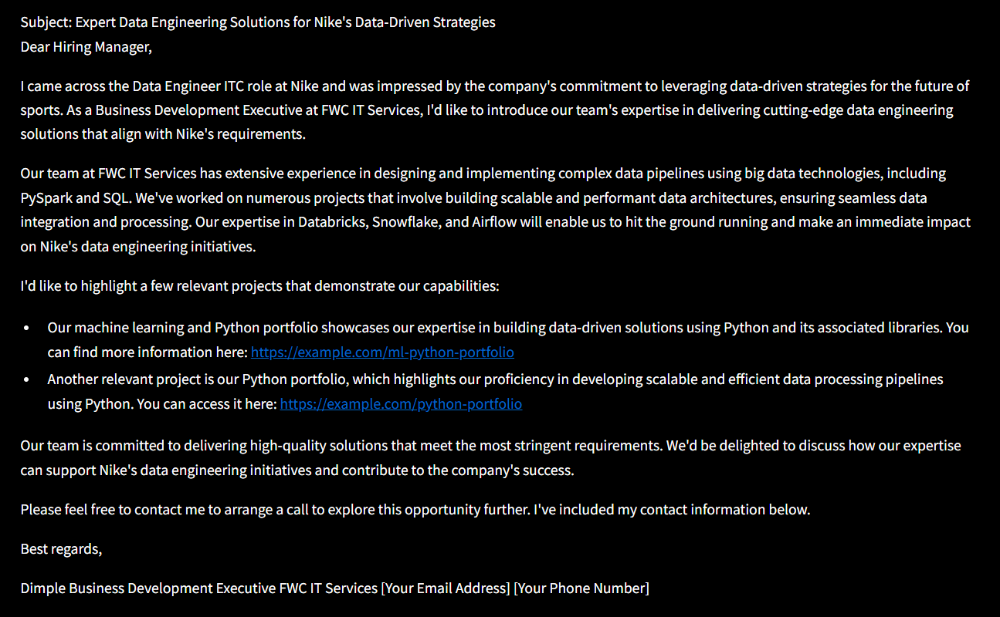

# 📧 Cold Mail Generator
Cold email generator for services company built with groq, langchain and streamlit Career Guidance CareerBuilder offers users the ability to type in a URL of their own (or any) company's careers page. It then scrapes job postings from that page and creates customized cold email messages. They contain the respective links from a vector DB related to the portfolio based on job description.

**Imagine a scenario:**

- Nike needs a Principal Software Engineer and is spending time and resources in the hiring process, on boarding, training etc.
- FWC is an IT Software Services company that can provide a dedicated software development engineer to Nike. So, the business development executive (Dimple) from FWC is going to reach out to Nike via a cold email.




## Architecture Diagram


## Set-up
1. To get started we first need to get an API_KEY from here: https://console.groq.com/keys. Inside `app/.env` update the value of `GROQ_API_KEY` with the API_KEY you created. 


2. To get started, first install the dependencies using:
    ```commandline
     pip install -r requirements.txt
    ```
   
3. Run the streamlit app:
   ```commandline
   streamlit run app/main.py
   ```